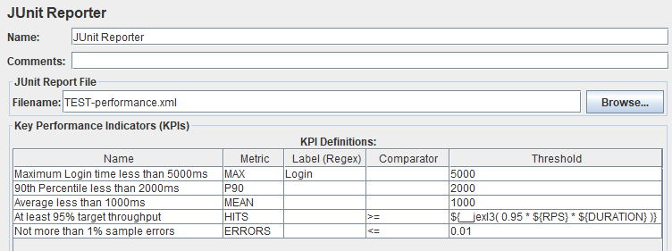

# jmeter-junit-reporter [![travis][travis-image]][travis-url]

[travis-image]: https://app.travis-ci.com/tilln/jmeter-junit-reporter.svg?branch=master
[travis-url]: https://app.travis-ci.com/tilln/jmeter-junit-reporter

Overview
--------

[Apache JMeter](https://jmeter.apache.org/) plugin for generating JUnit Reports in XML format,
based on custom KPIs (Key Performance Indicators).

Each KPI will be reported as a test case with a status of success, failure, skipped or error.

KPIs can be defined as thresholds for response time aggregates such as average, median or a percentile.

The output format is compatible with Jenkins, as described [here](https://llg.cubic.org/docs/junit/).

#### Example



#### Report

```xml
<?xml version="1.0" encoding="UTF-8"?>
<testsuite errors="0" failures="0" name="JUnit Reporter" skipped="0" tests="5">
  <testcase classname="Maximum Login time less than 5000ms"
            name="MAX(Login) &lt; 5000">
    <failure message="">Actual value 6230.000000 exceeds threshold 5000.000000 for samples matching "Login"</failure>
  </testcase>
  <testcase classname="90th Percentile less than 2000ms" name="P90(.*) &lt; 2000"/>
  <testcase classname="Average less than 1000ms" name="MEAN(.*) &lt; 1000"/>
  <testcase classname="At least 95% target throughput" name="HITS(.*) &gt;= 9500"/>
  <testcase classname="Not more than 1% sample errors" name="ERRORS(.*) &lt;= 0.01"/>
</testsuite>
```

Motivation
----------

JMeter offers several kinds of results output including summary statistics and calls to backend databases/services. 
None of them can be directly interpreted by CI/CD pipelines to determine the pass or fail outcome of a performance test.

Instead, further processing with third-party tools is required. Examples are:
- [Jenkins Performance Plugin](https://plugins.jenkins.io/performance/)
- [Taurus](https://gettaurus.org/)
- [Lightning](https://automatictester.github.io/lightning/)

Those tools have additional installation requirements and may have to process possibly large `*.jtl` files.

This plugin instead processes each sample as it occurs, with little memory or storage requirements.
Aggregates are calculated based on [Apache Commons Math3](https://commons.apache.org/proper/commons-math/userguide/stat.html)
statistics with "storageless" implementations. 

Usage
-----

#### JUnit Report File

- *Filename*: Name of the JUnit report file (with optional path, absolute or relative to current directory).
  An existing file with the same name will be overwritten without warning.

#### KPI Definitions

Each row defines an aggregate metric to calculate for a set of samplers/transactions (matching the Label column)
and to compare against a threshold.

- *Name*: For identification in the report file (will appear in the `classname` attribute).
- *Metric*: Defines the aggregate to be calculated of all samples.
  Supported values:

  |Metric|Meaning|
  |------|-------|
  | MEAN, AVERAGE, μ | Average response time (arithmetic mean) |
  | SD, σ | Standard Deviation of response times (population/non-bias corrected) |
  | Pn | n-th percentile response time (e.g. P90) |
  | MAX | Maximum response time |
  | MIN | Minimum response time |
  | HITS, SAMPLES | Total number of samples (requests) |
  | ERRORS | Error rate, fraction of unsuccessful samples (between 0 and 1) |

  Other, custom metrics can be defined by implementing the interface
  [`Metric`](src/main/java/nz/co/breakpoint/jmeter/Metric.java) 
  and specifying the fully-qualified class name in the *Metric* column.

  If the *Metric* is empty or invalid the KPI will be skipped.

- *Label (Regex)*: Regular expression defining what samples to include in calculation.
  An empty *Label* column matches all samples (equivalent to `.*`). The sample name must fully match the expression to be included. 
- *Comparator*: What operation to use for comparing the (actual) measured value with the (expected) threshold.
  Supported values: `<` (default), `<=`, `>`, `>=`.
- *Threshold*: Upper or lower bound that the value must not exceed. Decimal number.
  Unit is milliseconds for response time metrics. 
  KPI will be skipped if threshold is undefined or invalid.

#### Examples

|Name|Metric|Label (Regex)|Comparator|Threshold|
|----|------|-------------|----------|---------|
|#1  |P50   |Web_.*       |<=        |1000     |
|#2  |P50   |App_.*       |<=        |2000     |
|#3  |HITS  |.*           |>=        |${__jexl3( 0.95 * ${RPS} * ${DURATION} )}|

The first two KPIs are for the median (50th percentile) response time, for sample names beginning with "Web_"
and "App_" with different thresholds (1000 and 2000 milliseconds, respectively).

The third KPI asserts a minimum of 95% overall throughput by defining a threshold for the total number of samples
to compare with 95% of the product of requests per seconds and test duration (in seconds).


Installation
------------

### Via [PluginsManager](https://jmeter-plugins.org/wiki/PluginsManager/)

Under tab "Available Plugins", select "JUnit Reporter", then click "Apply Changes and Restart JMeter".

### Via Package from [JMeter-Plugins.org](https://jmeter-plugins.org/)

Extract the [zip package](https://jmeter-plugins.org/files/packages/tilln-junit-1.0.zip) into JMeter's lib directory, then restart JMeter.

### Via Manual Download

1. Copy the [jmeter-junit-reporter jar file](https://github.com/tilln/jmeter-junit-reporter/releases/download/1.0/jmeter-junit-reporter-1.0.jar) into JMeter's lib/ext directory.
2. Restart JMeter.


Limitations
-----------

- Minimum JMeter version 5.0
- Calculations are double precision
- Only Sample response times are processed, other measurements such as connect time or latency are not supported
